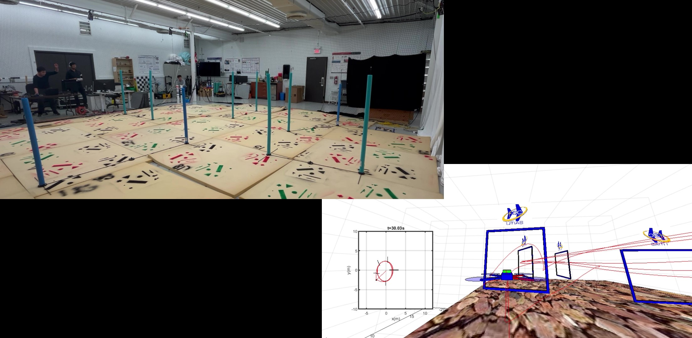
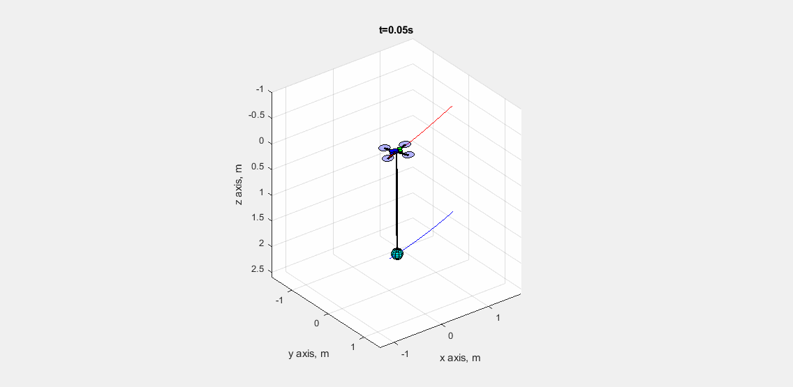
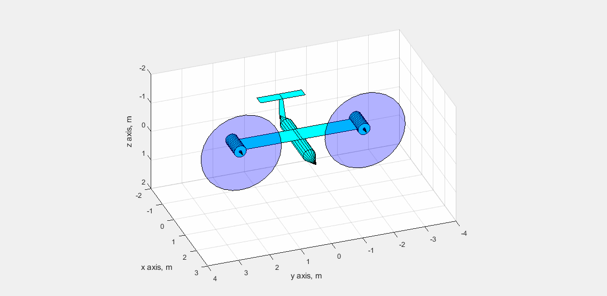

# Matlab Flight Simulation Animation Package

[](https://GitHub.com/Naereen/StrapDown.js/graphs/commit-activity) 

## A concrete and ready-to-use visualization package written in Matlab for flight simulation.

## Author
Dr. Longhao Qian

- Ph.D., M.Eng, MS, BS in Aerospace Science and Engineering.
- Field of interest: UAV, machine learning, flight simulation, and optimization
- [linkedin](https://www.linkedin.com/in/longhao-qian-68705415a/) 

## Please cite this repository
### APA format
```
Qian, L. (2023). Matlab Drone Simulation Visualization Package (Version 1.0.0) [Computer software]. https://doi.org/10.5281/zenodo.10359983
```
### BibTex
```
@software{Qian_Matlab_Drone_Simulation_2023,
author = {Qian, Longhao},
doi = {10.5281/zenodo.10359983},
month = dec,
title = {{Matlab Drone Simulation Visualization Package}},
url = {https://github.com/LonghaoQian/AnimationModels},
version = {1.0.0},
year = {2023}
}
```
Alternatively, you could obtain the citation from GitHub citation tap:


## What is this package?
- Provides a compact and easy way to generate animations from flight simulation data.
- Encapsulates and concentrates individual 3D rendering functions into a single function to provide a clean and concrete interface. 
- I also provide [background information and coding guide](examples/README.md) about how to generate animations in a Matlab environment.
- [The coding guide](examples/README.md) also teaches you about how to build your own customized visualization based on the code in this package. 

## Examples
### A fixed-wing drone simulation with artificial horizon display

### A quadrotor drone flying through gates (click picture to watch the video)
[](https://www.youtube.com/watch?v=6eZ8LsYYfVw "Computationally Efficient Time-optimal Trajectory Planner Showcase")
### A racing quadrotor drone simulation

- Racing drone flight data are provided by [Chao Qin](https://github.com/ChaoqinRobotics).
### A quadrotor with a slung payload

### A twin-engine VTOL with tilting engines
