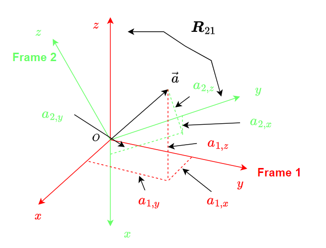

# Rotation Matrix
## Syntax

There are two reference frames: frame 1 and frame 2. The rotation matrix between frame 1 and frame 2 is defined as .
This means that for the same vector $\vec{a}$, its coordinates in frame 1 and frame 2, i.e.  and , have the following relationship:


where


as shown in the following figure




## Euler angles and the corresponding rotation matrix

The rotation of reference frames can be achived by using the euler angles. In avaiation, we use $\phi$, $\theta$, $\psi$ to denote the roll, pitch, and yaw angle representing the rotation around the x, y, and z axis. The following figure shows the rotation around these axis

The rotation matrix generated by Euler angles are given as follows:


This package provides the code in the [utils folder](../../src/utils/) to generate rotation matrix:

```
\src\utils\util_rotationX.m
\src\utils\util_rotationY.m
\src\utils\util_rotationZ.m
```

# Coordniate Frames
## The ENU (east-north-up frame) and the NED (north-east-down frame)
There are two major frames usined in aviation: the ENU frame and the NED frame, as shown in the following figure


The rotation matrix between the END frame (frame E) and the NED frame (frame N) is


# The Frame System in Matlab Animation
Each object, such as patch, surface, line, text, defined in a matlab plot, is associated with a graphics frame. By default, all the objects are assigned to the global frame of an axis. If you need to assign it to a differernt frame, you need to define your custom frame first:

```
childFrame = hgtransform('Parent', parentFrame);
```

To associate an object with a frame, you need to explicitly declare the ``'Parent'`` attribute at its creation. For example, in [CreatePlane.m](../../src/models/CreatePlane.m), if we need to attach a patch object to the model frame, we need to add ``'Parent', planeObj.frame_model`` as arguments of the patch function:

```
% define the wing    
planeObj.wing = patch('Faces', [1 2 3 4]...
        , 'Vertices', [c/2, b/2, r; -c/2, b/2, r; -c/2, -b/2, r; c/2, -b/2, r], 'FaceColor', 'cyan', 'Parent', planeObj.frame_model);
```

You can create frames in a chain to rotate and transform part of your model:

```
frame2 = hgtransform('Parent', frame1);
frame3 = hgtransform('Parent', frame2);
frame4 = hgtransform('Parent', frame3);
```

In this way, if you define your model in frame 1~4, you could perfom complex tranformation to create animation for a multi-body system such as a vtol. For example, in [CreateTwinEngineVtol.m](../../src/models/CreateTwingEngineVtol.m), the engine frame of the vtol is associated with the parent plane model frame ``vtolObj.plane.frame_model``

```
vtolObj.leftEngineObj = CreatePropellerEngine(vtolObj.para.engineLength, vtolObj.para.engineRadius, vtolObj.para.rotorRadius, 'cyan', 'blue', vtolObj.plane.frame_model);
```

Then to rotate the engine, in [UpdateEngineAngleTwinEngineVtol.m](../../src/models/UpdateEngineAngleTwinEngineVtol.m), we can set the transform matrix between the engine frame (``vtolObj.leftEngineObj.frame``) and the plane model frame (``vtolObj.plane.frame_model``):

```
set(vtolObj.leftEngineObj.frame, 'Matrix', makehgtform('translate', vtolObj.para.leftEnginePos) * makehgtform('yrotate', -leftEngAngle + pi/2));
```

# Transforming Frames in Matlab Figures
## How to transform a frame w.r.t. another frame
If the object is define in a frame other than the global frame, you could transform the object by transforming its associated frame. (You can not transform the object directly). Note that all transformations are performed w.r.t. the parent frame. To create a transformation between frames, use the  ``makehgtform`` function:

```
T = makehgtform('translate', position)
R = makehgtform('yrotate', angle)
```

## The Linear Transformation
The linear transformation is produced by 

For example, in [CreatePlane.m](../../src/models/CreatePlane.m), to move the fuselage alone the x axis of the model frame ``planeObj.frame_model``, set the first arguement of  ``makehgtform``  as  ``translate``, and the displacement in  ``planeObj.frame_model`` as the second argument.

```
T = makehgtform('translate',[L/2 ,0, 0]);
```


## The Rotational Transformation
The convention of rotating objects in Matlab is different from the one in coordinate transformation. 

```
R = makehgtform('yrotate', pi/2); 
```

If the rotation matrix between the 

## Apply Combined Transformations

To apply the transformation, use the ``set`` function. The syntax is as follows:
([fixedwing_straightline_path.m](../../examples/fixed-wing%20model/fixedwing_straightline_path.m))

```
set(planeObj.frame, 'Matrix', T * R);
```

Note that since all the transformation are performed in the parent frame, 


```
C21 = reshape(pathsim.Rbe(:, :, k), 3, 3)';
R = [C21 zeros(3, 1);
    zeros(1, 3), 1];
T = makehgtform('translate',[pathsim.Xe(k, 1) ,pathsim.Xe(k, 2), pathsim.Xe(k, 3)]);
set(planeObj.frame, 'Matrix', T * R);
set(planeObj2.frame, 'Matrix', T * R);
```

```
    R = GenerateHgRotation([pathsim.attitude(k, 1), pathsim.attitude(k, 2), pathsim.attitude(k, 3)], 'euler', "NED");
    T = makehgtform('translate',[pathsim.Xe(k, 1) ,pathsim.Xe(k, 2), pathsim.Xe(k, 3)]);
    set(planeObj.frame, 'Matrix', T * R);
    set(planeObj2.frame, 'Matrix', T * R);
```


For detailed explainations, please search the above commands in Matlab Help Documents

- [hgtransform](https://www.mathworks.com/help/matlab/ref/hgtransform.html)
- [makehgtform](https://www.mathworks.com/help/matlab/ref/makehgtform.html)

# Camera Model
By default, the view mode for a 3D model is set to orthonoraml. 