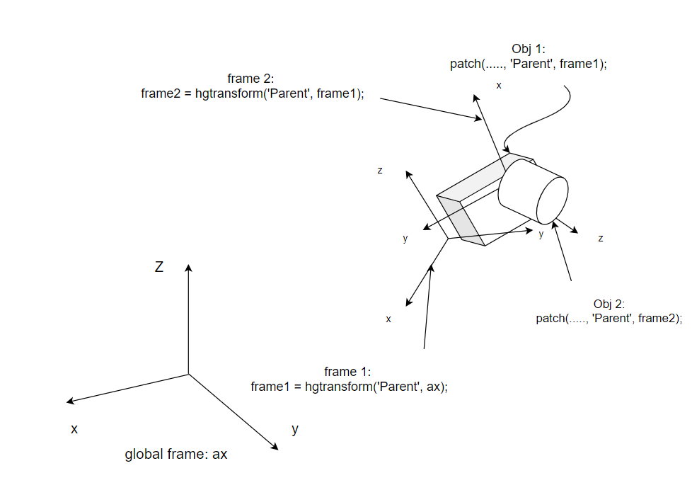

# The Frame System in Matlab Animation
Each object, such as a patch, surface, line, or text, defined in a Matlab plot, is associated with a graphics frame. By default, all the objects are assigned to the global frame of an axis. If you need to assign it to a different frame, you need to define your custom frame first by using the `hgtransform` function:

```
childFrame = hgtransform('Parent', parentFrame);
```
**The default global frame of an axis is the return value of `axes`.** For example:

```
ax = axes('Position',[0.1 0.1 0.8 0.8],  'XLim',[-400 400],'YLim',[-400 400],'ZLim',[0 150], 'DataAspectRatio', [1 1 1]);
```

To associate an object with a frame, you need to explicitly declare the ``'Parent'`` attribute at its creation. For example, in [CreatePlane.m](../../src/models/CreatePlane.m), if we need to attach a patch object to the model frame, we need to add ``'Parent', planeObj.frame_model`` as arguments of the patch function:

```
% define the wing    
planeObj.wing = patch('Faces', [1 2 3 4]...
        , 'Vertices', [c/2, b/2, r; -c/2, b/2, r; -c/2, -b/2, r; c/2, -b/2, r], 'FaceColor', 'cyan', 'Parent', planeObj.frame_model);
```

You can create frames in a chain to rotate and transform part of your model:

```
frame2 = hgtransform('Parent', frame1);
frame3 = hgtransform('Parent', frame2);
frame4 = hgtransform('Parent', frame3);
```

This way, if you define different parts of your model in frames 1~4, you could perform a complex transformation to create an animation for a multi-body system as shown in the following figure:



For example, in [CreateTwinEngineVtol.m](../../src/models/CreateTwingEngineVtol.m), the engine frame of the vtol is associated with the parent plane model frame ``vtolObj.plane.frame_model``

```
vtolObj.leftEngineObj = CreatePropellerEngine(vtolObj.para.engineLength, vtolObj.para.engineRadius, vtolObj.para.rotorRadius, 'cyan', 'blue', vtolObj.plane.frame_model);
```

Then to rotate the engine, call [UpdateEngineAngleTwinEngineVtol.m](../../src/models/UpdateEngineAngleTwinEngineVtol.m) to set the transform matrix between the engine frame (``vtolObj.leftEngineObj.frame``) and the plane model frame (``vtolObj.plane.frame_model``):

```
set(vtolObj.leftEngineObj.frame, 'Matrix', makehgtform('translate', vtolObj.para.leftEnginePos) * makehgtform('yrotate', -leftEngAngle + pi/2));
```

# Transforming Frames in Matlab Figures
## How to transform a frame w.r.t. another frame
If the object is defined in a frame other than the global frame, you could transform the object by transforming its associated frame. (you can not transform the object directly). Note that all transformations are performed w.r.t. the parent frame. To create a transformation between frames, use the  ``makehgtform`` function:

```
T = makehgtform('translate', position)
R = makehgtform('yrotate', angle)
```

## The Linear Transformation
The linear transformation is produced by `` makehgtform`` by setting the first argument to `'translate'`. For example, in [CreatePlane.m](../../src/models/CreatePlane.m), to move the fuselage along the x-axis of the model frame ``planeObj.frame_model``, set the first argument of  ``makehgtform``  as  ``translate``, and the displacement in  ``planeObj.frame_model`` as the second argument.

```
T = makehgtform('translate', [L/2 ,0, 0]);
```

Note that the transformation is performed w.r.t. the parent frame.

## The Rotational Transformation
The rotation transformation is defined by setting the first argument as ``xrotate``,  ``yrotate``, or ``zrotate``. The second argument is the rotation angle in radians. Note that the rotation is performed w.r.t. the parent frame.

```
R = makehgtform('yrotate', pi/2); 
```
**The convention of rotating objects in Matlab animation is different from the one in coordinate transformation. If Euler angles are used in the so-called 3-2-1 sequence, the rotation transformation should be applied in a 1-2-3 order.** For example, in [GenerateHgRotation.m](../../src/utils/GenerateHgRotation.m), the total compounded rotation based on Euler angles is defined as:

```
Rx = makehgtform('xrotate', ax);
Ry = makehgtform('yrotate', ay);
Rz = makehgtform('zrotate', az);
R = Rz * Ry * Rx;
```
$\phi$ rotation is performed first and $\psi$ rotation is performed last.

If the rotation matrix between two frames is available, one can skip the use of ``makehgtform`` and directly use the rotation matrix. Let $R_{12}$ be the rotation matrix, the 4-by-4 transformation matrix $R$ is defined as follows:

```
R = [R12 zeros(3, 1);
     zeros(1, 3), 1];
```

where frame 1 is the parent frame, and frame 2 is the child frame. Note that `makehgtform('xrotate', ax)` creates a 4-by-4 transformation matrix with the top left 3-by-3 block equal to $R_{12}(\phi)$.

## Apply Compounded Transformations

To apply the transformation, use the ``set`` function. The syntax is as follows:

```
set(frame, 'Matrix', T * R);
```

For example, in [fixedwing_straightline_path.m](../../examples/fixed-wing%20model/fixedwing_straightline_path.m), if we need to transform the plane to its simulated location and attitude, one can use the following code:

```
set(planeObj.frame, 'Matrix', T * R);
```

The compounded transformation is performed by multiplying transformation matrices. The order of the transformation is performed from right to left. **Note that calling the ``set`` function multiple times does not perform the compounded transformation, the last call of the ``set`` function overwrites the previous transformations.**

If $R_{12}$ is provided, for example in [fixedwing_straightline_path.m](../../examples/fixed-wing%20model/fixedwing_straightline_path.m), the transformation of the aircraft is performed as follows:

```
R = [Reb zeros(3, 1);
    zeros(1, 3), 1];
T = makehgtform('translate',[pathsim.Xe(k, 1) ,pathsim.Xe(k, 2), pathsim.Xe(k, 3)]);
set(planeObj.frame, 'Matrix', T * R);
```

If Euler angles are used, for example in [fixedwing_circular_path.m](../../examples/fixed-wing%20model/fixedwing_circular_path.m), the transformation of the aircraft is performed as follows:

```
R = GenerateHgRotation([pathsim.attitude(k, 1), pathsim.attitude(k, 2), pathsim.attitude(k, 3)], 'euler', "NED");
T = makehgtform('translate',[pathsim.Xe(k, 1) ,pathsim.Xe(k, 2), pathsim.Xe(k, 3)]);
set(planeObj.frame, 'Matrix', T * R);
```

**Since all transformations are performed w.r.t. the parent frame, rotation should be performed before the translation. as show in the following figure:**


- In the left figure, the rotation labeled as 1 is perfomed before the translation labeled 2.
- In the right figure, the translation labeled as 1 is perfomed before the rotation labeled 2.
- If the translation is performed before the rotation, then the rotation transformation will also change the position of the object because the rotation is performed w.r.t. the parent axis.

For detailed explanations, please search the following commands in Matlab Help Documents

- [hgtransform](https://www.mathworks.com/help/matlab/ref/hgtransform.html)
- [makehgtform](https://www.mathworks.com/help/matlab/ref/makehgtform.html)

**[Back To Table of Contents](../README.md)**