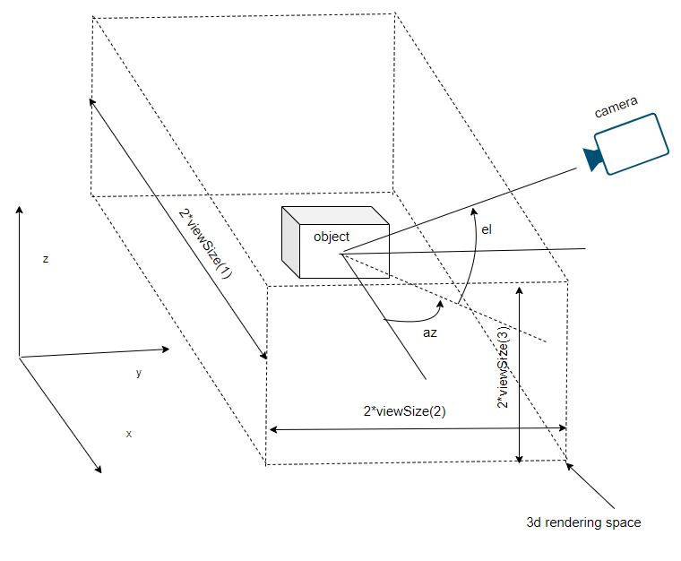
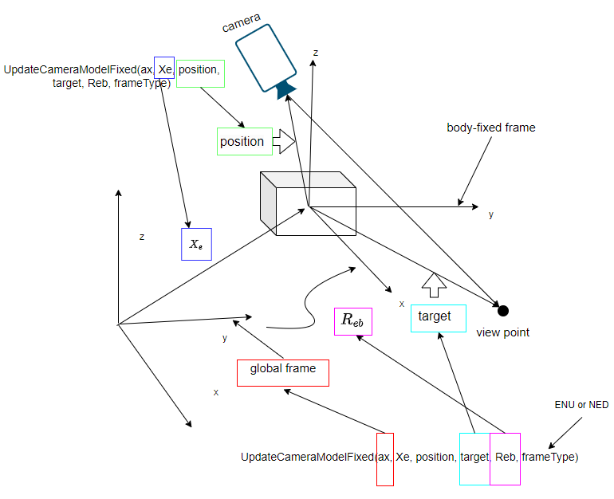
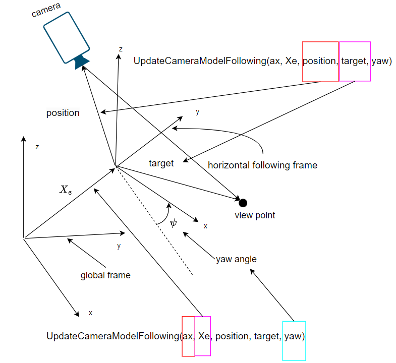

# Camera Settings
This package provides the 3 types of camera modes:
## The Side View Mode

The side view mode is the default view. Use [UpdateCameraModelSideView.m](../../src/camera/UpdateCameraModelSideView.m) to specify the camera.


The view is centered on the center of the 3D model. The view size denotes the size of the 3D rendering space as shown in the following figure:



Read this [page](https://www.mathworks.com/help/matlab/ref/view.html) for more details of the ``view`` function.

## The Free-flying Mode
- For more cinematic FPV views, you may use the free-flying mode.
- For camera graphics terminology, read this [page](https://www.mathworks.com/help/matlab/creating_plots/defining-scenes-with-camera-graphics.html).
- Initialize the camera before using the functions in this package.
- There are 2 sub-modes of the free-flying mode: the body-fixed mode and the horizontal-following mode.

### Initialize the camera
- Before updating the free-flying camera, one needs to initialize the camera view angle and projection mode by using [InitCamera.m](../../src/camera/InitCamera.m).
- The field of view is set by ``fov`` in degrees.
- The projection mode is set to ``perspective`` or ```orthographic```. The recommended setting is ``perspective``.


### The body-fixed mode
In the body-fixed mode, the camera is fixed to an object as shown in the following figure. Use [UpdateCameraModelFixed.m](../../src/camera/UpdateCameraModelFixed.m) to update the camera. This view together with the HUD module can be used as a FPV view for drones and flight simulation.


The geometry of the body-fixed mode is shown in the following figure:


- The camera is fixed in the body-fixed frame. The viewpoint defined in the body-fixed frame is denoted by the argument called ``target``.
- The camera position relative to the origin of the body-fixed frame is denoted as ``position``.
- The rotation matrix between the body-fixed frame and the global frame is denoted as ``R_eb``. The global frame axis is denoted as ``ax``.
- The position of the body-fixed frame relative to the global frame is denoted as ``Xe``.



### The horizontal-following mode

The geometry of the horizontal-following mode is shown in the following figure:


- Use [UpdateCameraModelFollowing.m](../../src/camera/UpdateCameraModelFollowing.m)  to update the camera.
- The horizontal-following frame is a frame following the model, but only rotated around the z axis by $\psi$, ignoring pitch and roll.
- The camera is fixed in the horizontal-following frame. The view point defined in the horizontal-following frame is denoted by the argument called ``target``.
- The camera position relative to the origin of the body-fixed frame is denoted as ``position``.
- The position of the horizontal-following frame relative to the global frame is denoted as ``Xe``.
- The yaw angle is set by the argument called ``yaw``.



**[Back To Table of Contents](../README.md)**