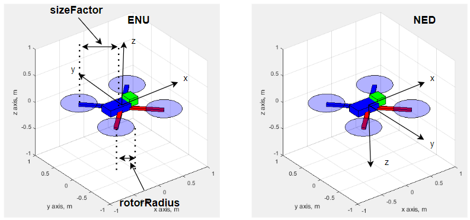

# Built-in Models
- This package provides the following built-in models that can be created by a single function call.
- Read [Background of Rotations](rotation_matrix.md) for more details about mathematical background.
- [Matlab Animation Frame System](animation_frame_system.md) explains in detail how frame systems work in Matlab.
- Run [display_model.m](../display_model.m) to show all the models.

## Quadrotor
- To create a quadrotor, call [CreateQuadRotor.m](../../src/models/CreateQuadRotor.m);
- The body-fixed frame of the plane is ``planeObj.frame``;
- ``sizeFactor`` determines the length of the arm,  ``rotorRadius`` is the radius of the rotor. All other components are scaled proportionally to the length of the arm.
- The parent axis of the quadrotor is set by the argument ``mainAxis``
- One could specify the type of the reference frame by the last argument.

## Fixed-wing plane
- To create a fixed-wing plane, call [CreatePlane.m](../../src/models/CreatePlane.m);
- The fuselage length is 1.6 * ``sizeFactor``, the wing span is 1.8 * ``sizeFactor``.
- The parent axis of the quadrotor is set by the argument ``mainAxis``
- All other components are scaled proportionally to the wing span.

## Vtol

- To create a vtol, use [CreateTwingEngineVtol.m](../../src/models/CreateTwingEngineVtol.m)
- To rotate the engines around the wing, use [UpdateEngineAngleTwinEngineVtol.m](../../src/models/UpdateEngineAngleTwinEngineVtol.m). 0 deg means that the propeller is facing forward. 90 deg means facing upward.
- The fuselage length is 1.6 * ``sizeFactor``, the wing span is 1.8 * ``sizeFactor``.
- The parent axis of the quadrotor is set by the argument ``mainAxis``.
- The body-fixed frame of the plane is ``planeObj.frame``.
- All other components are scaled proportionally to the wing span.

## Gate

- To create a gate, use [CreateRroundGate.m](../../src/models/CreateRroundGate.m)
- ``innerRingRadius``, ``marginWidth``, ``totalLength`` are labeled in the following figure.
- The main axis of the model is ``gateObj.frame``.

## Hud

- To create hud, call [CreateSimpleHud.m](../../src/hud/CreateSimpleHud.m)
- To update hud in the loop, call [UpdateSimpleHud.m](../../src/hud/UpdateSimpleHud.m)
- As shown in [fixed_wing_circular_path.m](../fixed-wing%20model/fixedwing_circular_path.m), hub must be placed on a separate axis on top of the existing axis. Therefore, [CreateSimpleHud.m](../../src/hud/CreateSimpleHud.m) must be called after the creation of the axis that contains the 3d objects such as plane and trajectory.
- Set the background color to ``'none'`` to make the background transparent.
- The hud should be used in combination with the [body-fixed camera](camera_settings.md) mode to provide an intuitively correct display.
- The inputs are shown in the following figure:

# Building Custom 3D models
## 3D surfaces
- To learn how to create 3d surfaces, read more details about the [patch](https://www.mathworks.com/help/matlab/ref/patch.html) and the [surf](https://www.mathworks.com/help/matlab/ref/surf.html) command.

- There are two main steps in defining custom 3d surfaces: 1. define the vertices, 2. define the 3d body.

- Once vertices are provided, use ``patch`` and ``surf`` to generate 3d model.

## Line primitive
- Normally, one uses ``plot`` function to draw lines in Matlab. This command not only defines a line but also resets the axis properties, so in 3d animation it is not desirable.
- In 3d animation, we resort to the ``line`` function. This function defines a figure primitive without interfering with other settings of the 3d rendering. 
- Use ``drawnow`` function to render the figure once all the figure primitives are updated.

## Specify the parent frame. 
- The most important property of a 3d model is its parent frame as it realizes the transformation of the model.
- The parent frame is set upon the creation of the figure primitive by adding ``'Parent', mainAxis`` in the 3d generation command.
- One can also use the ``set`` function to update the parent axis of an existing model.

## Putting multiple objects together
- Read [Matlab Animation Frame System](animation_frame_system.md) about the frame system in Matlab.
- Here is an example of how to build a quadrotor model. Please refer to [CreateQuadRotor.m](../../src/models/CreateQuadRotor.m) for detailed steps.
- Key steps are shown in the following figure:

- The first step is to define the reference frame by using the ``hgtransform`` command. The body-fixed frame is ``quadObj.frame``, and the model frame is ``quadObj.frame_model``. All 3d models are defined in ``quadObj.frame_model``.
- In our example, if you pick the ``NED`` option, then ``quadObj.frame_model`` will rotate around the x axis for 180 deg.

- The arm and rotor are defined by using the [patch](https://www.mathworks.com/help/matlab/ref/patch.html) command.
- The parent frame of the rotor is set to ``quadObj.armframe``. The parent frame of the ``quadObj.armframe`` is ``quadObj.frame_model``. To place the rotor at the correct location, transforms are made in the for loop.
- The transformation is defined by using [makehgtform](https://www.mathworks.com/help/matlab/ref/makehgtform.html). Then the ``set`` function is called with a property name ``'Matrix'`` and the transformation matrix as the arguments.
- To define the body, we follow the similar procedures. Note that the [CreateBox](../../src/models/CreateBox.m) function defines a box object. The parent frame of the box is ``quadObj.frame_model``. After its creation, the box is moved to its place by using [makehgtform](https://www.mathworks.com/help/matlab/ref/makehgtform.html) and the ``set`` function.

**[Back To Table of Contents](../README.md)**