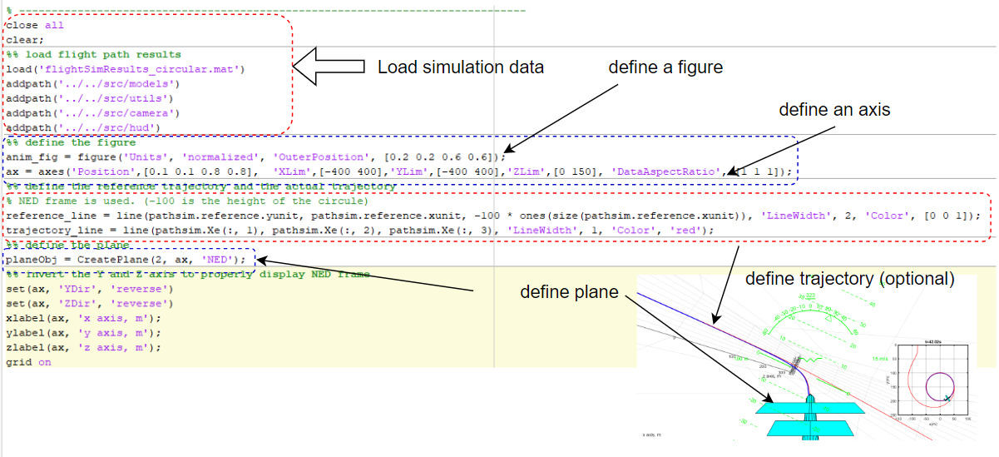
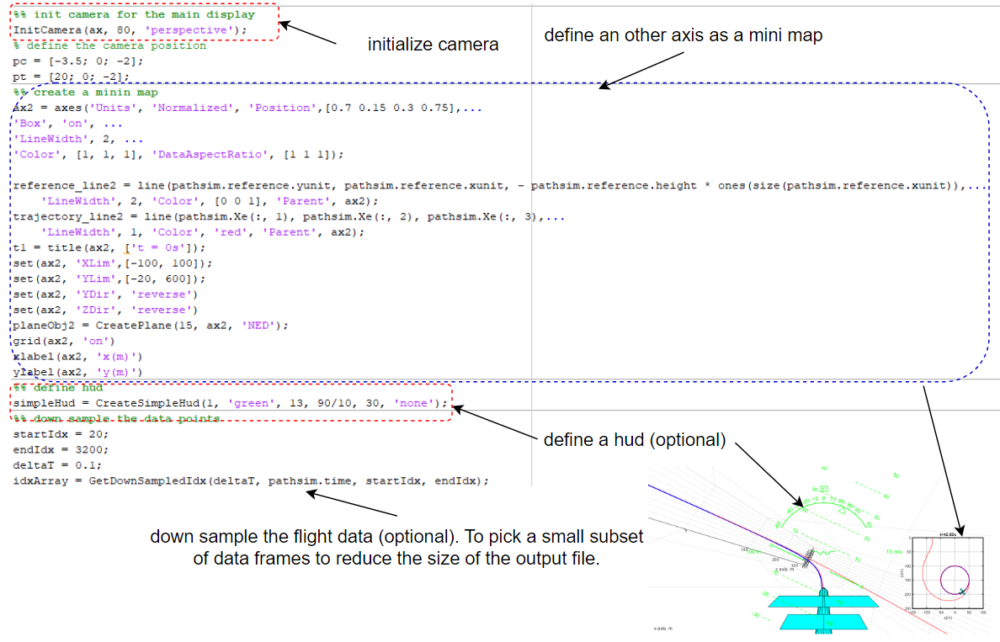
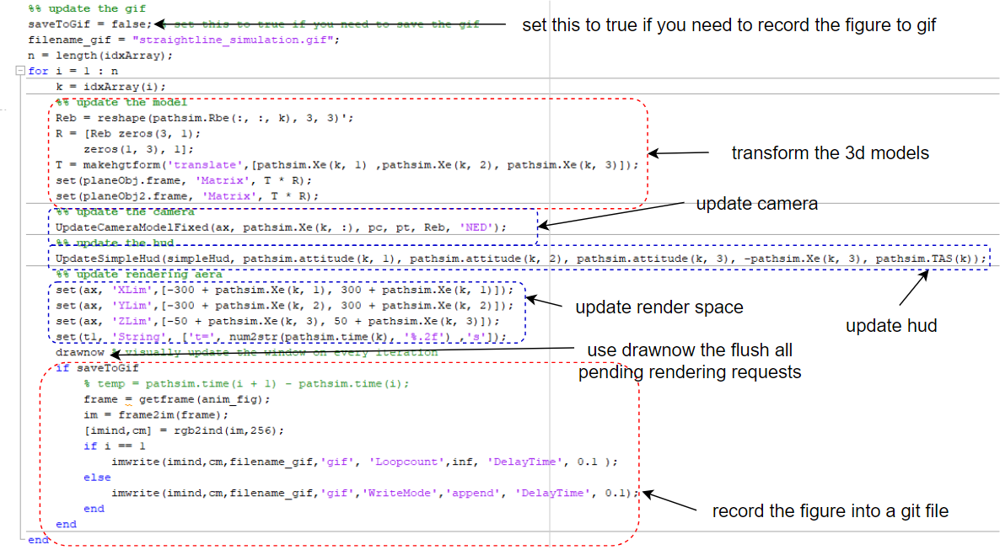

# The Overall Procedure
The overall procedure is summarized in the following figure:

## Code Example
- Run [fixedwing_circular_path.m](../fixed-wing%20model/fixedwing_circular_path.m), and observe the results.
- The procedures of the animation are shown in the following figures:

## How to modify the code to fit your needs?
- Load your own simulation data. The simulation data must contain the position and the attitude of the aircraft.
- If you need to use HUD, your flight simulation data must also include airspeed.
- You could use the [Built-in Models](model_building.md) to quickly create models.
- If you need to modify the model, please read [Built-in Models](model_building.md) and [Matlab Animation Frame System](animation_frame_system.md) to build your custom model.

## Bulit-in models in this package

- There are several models provided in this package that can be created by a simple function call.
- Please read [Built-in Models](model_building.md) for more details.

## Transform your model

- Read [Background of Rotations](rotation_matrix.md) for more details about mathematical background.

- [Matlab Animation Frame System](animation_frame_system.md) explains in detail about how frame systems work in Matlab.

- You could use [GenerateHgRotation.m](../../src/utils/GenerateHgRotation.m) to generate rotation transformation from Euler angles.

## Update cameras

- [Camera Settings](camera_settings.md) explains in detail about how to define and update a proper camera in animation

## Models with multiple components

- [Matlab Animation Frame System](animation_frame_system.md) explains in detail about how frame systems work in Matlab.
- Read [CreateTwingEngineVtol.m](../../src/models/CreateTwingEngineVtol.m) to learn how to build a model with rotating parts.
- Please read [Built-in Models](model_building.md) for how to assemble a model with multiple parts.

**[Back To Table of Contents](../README.md)**