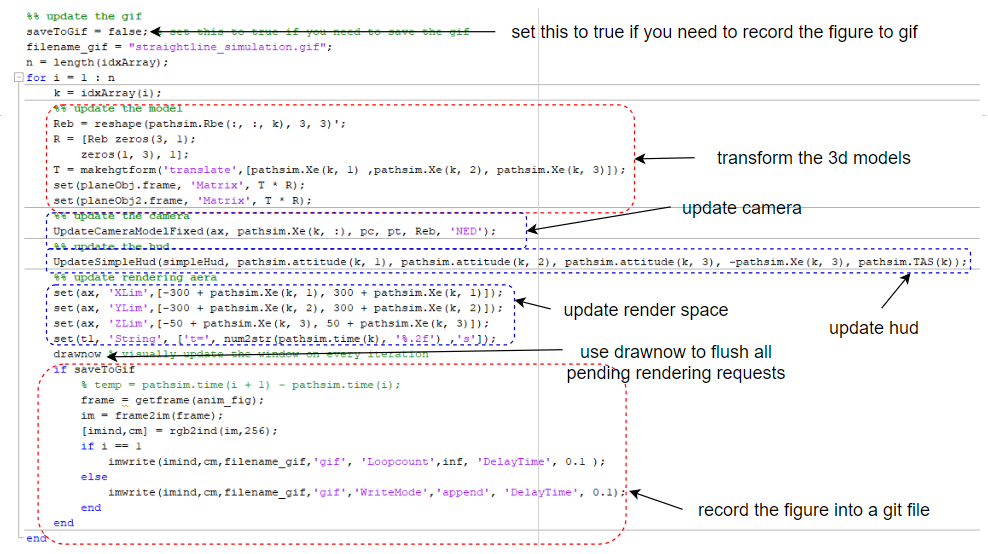

# The Overall Procedure
The overall procedure of the entire process is summerized in the following figure:

## Code Example

We use [fixedwing_cirular_path.m](../fixed-wing%20model/fixedwing_cirular_path.m) as an example. The procedure of the animation create is labeled in the following figures:

## How to modify the code to fit your need?
- Load your own simulation data. The simulation data must contain position and attitude of the aircraft.
- If you need to HUD, your flight simulation data must also include airspeed.
- You could use the [Built-in Modles](model_building.md) to quickly create models.
- If you need to modify the model, please read [Built-in Modles](model_building.md) and [Matlab Animation Frame System](animation_frame_system.md) to build your custom model.

## Bulit-in models in this package

- There are several models provided in this package that can be created by a simple function call.
- please read [Built-in Modles](model_building.md) for more details of building a 3d model in Matlab.

## Rotate and translate your model

- [Matlab Animation Frame System](animation_frame_system.md) explains in details about how frame systems work in Matlab.

- Rotation and translation are done by using 
## Define and update cameras

- [Camera Settings](camera_settings.md)  explains in details about how to define a proper camera in animation

## Model with manipulate components

**[Back To Table of Contents](../README.md)**