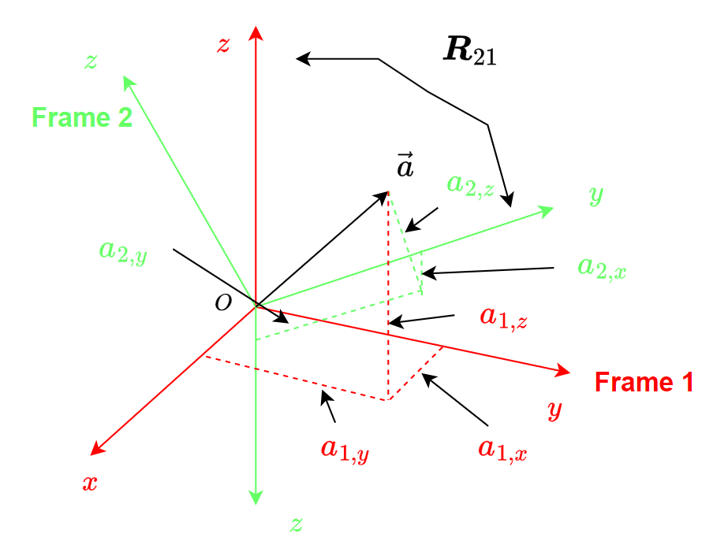
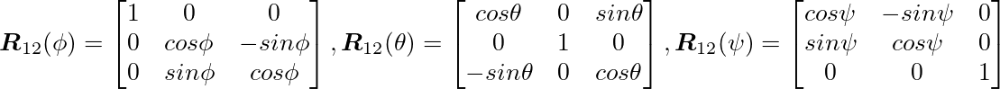
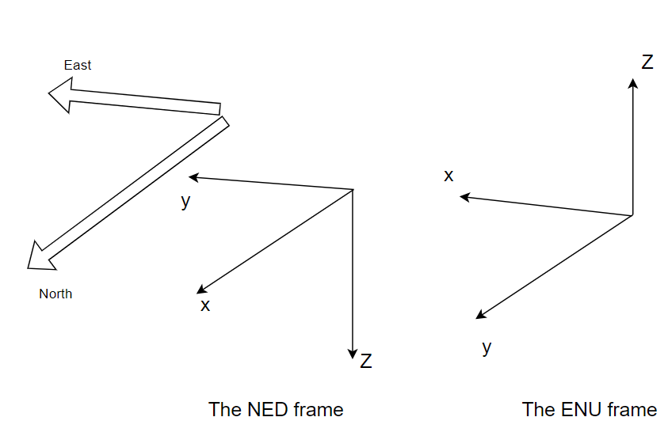
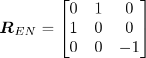

# Some Background of Rotations
## Syntax of Rotation Matrices

There are two reference frames: frame 1 and frame 2. The rotation matrix between frame 1 and frame 2 is defined as $R_{21}$.
This means that for the same vector $\vec{a}$, its coordinates in frame 1 and frame 2, i.e. $a_1$ and $a_2$, have the following relationship:

$$a_2=R_{21}a_1$$

where


as shown in the following figure




## Euler angles and the corresponding rotation matrix

The rotation of reference frames can be achived by using the euler angles around principle axis. In avaiation, we use $\phi$, $\theta$, $\psi$ to denote the roll, pitch, and yaw angle representing the rotation around the x, y, and z axis. If frame 1 is the stationary frame, and frame 2 rotates w.r.t. frame 1 by an Euler angle, then the rotation matrix between frame 1 and 2 are as follows:



This package provides the code in the [utils folder](../../src/utils/) to generate rotation matrix around principle axis:

```
\src\utils\util_rotationX.m
\src\utils\util_rotationY.m
\src\utils\util_rotationZ.m
```

# Coordniate Frames
## The ENU (east-north-up frame) and the NED (north-east-down frame)
- There are two major frames usined in aviation: the ENU frame and the NED frame, as shown in the following figure



- You may read this [page](https://en.wikipedia.org/wiki/Axes_conventions#:~:text=World%20reference%20frames%3A%20ENU%20and%20NED,-Main%20article%3A%20Local&text=Basically%2C%20as%20lab%20frame%20or,NED) for detailed explainations.

- The rotation matrix between the END frame (frame E) and the NED frame (frame N) is




**[Back To Table of Contents](../README.md)**